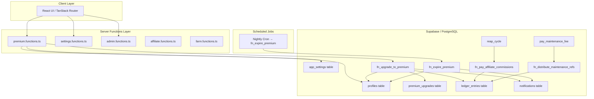

# Design Document: Premium Membership

## Overview

The Premium Membership feature introduces a paid annual membership tier (`premium`) to the VFarmers platform. Standard Farmers may upgrade by paying a configurable USDT fee, unlocking enhanced farming returns, three-generation referral commissions, maintenance fee referral rewards, a lower withdrawal fee, and a visible premium badge. Super Admins configure all monetary parameters and have access to an analytics dashboard.

The design is intentionally tier-agnostic: the `membership_tier` enum ships with `gold` and `platinum` reserved values from day one, the `is_premium` generated column evaluates true for all higher tiers, and the badge component accepts `name` and `color` as props rather than hard-coded constants. Adding Gold or Platinum in a future release requires configuration changes, not schema redesign.

**Key design decisions:**

- All monetary parameters (fees, bonus percentages, durations) live exclusively in `app_settings` and are read at runtime — never hard-coded.
- The upgrade database transaction (`fn_upgrade_to_premium`) is a `SECURITY DEFINER` PostgreSQL function. Moving the atomic multi-table write inside the database eliminates any risk of partial failure from network issues between server function steps.
- Premium tier enforcement is handled inline at every business logic point (farming reward, commission distribution, withdrawal fee) based on the current `membership_tier` and `premium_expires_at` rather than a single gating flag. This means expiry is respected immediately without waiting for the nightly `fn_expire_premium` cron job.
- The nightly expiry job exists to clean up stale rows so the `is_premium` generated column stays accurate and UI queries remain fast.

---

## Architecture



The server functions layer (`src/lib/premium.functions.ts`) is the sole TypeScript entry point for all premium-related mutations. Database functions (`fn_*`) handle atomicity. The UI routes consume server functions via `useServerFn` from `@tanstack/react-start`.

---

## Components and Interfaces

### New Files

| Path | Purpose |
|---|---|
| `src/lib/premium.functions.ts` | All server functions for premium operations |
| `src/routes/_authenticated/upgrade.tsx` | Upgrade / Renew page |
| `src/routes/_authenticated/admin/premium.tsx` | Admin Premium page |
| `src/components/premium/PremiumBadge.tsx` | Reusable badge component |
| `src/components/premium/UpgradeCTA.tsx` | Upgrade call-to-action card |
| `supabase/migrations/<timestamp>_premium_membership.sql` | All DDL and function changes |

### Modified Files

| Path | Changes |
|---|---|
| `src/routes/_authenticated/dashboard.tsx` | Add PremiumBadge or UpgradeCTA based on tier |
| `src/routes/_authenticated/profile.tsx` | Add PremiumBadge and expiry date display |
| `src/routes/_authenticated/withdraw.tsx` | Show tier-specific fee before submission |
| `src/routes/_authenticated/affiliate.tsx` | Lock/unlock Gen2/Gen3 commission display |
| `src/routes/_authenticated/admin/index.tsx` | Add Premium tile |
| `src/components/app-sidebar.tsx` | Conditionally show "Upgrade to Premium" item |
| `src/lib/notification-meta.ts` | Add entries for 3 new notification kinds |

### Server Function Interfaces (`src/lib/premium.functions.ts`)

```typescript
// Public — no auth required
getPremiumConfig(): Promise<PremiumConfig>

// Authenticated user functions
getPremiumStatus(): Promise<PremiumStatus>
upgradeToPremium(): Promise<PremiumStatus | PremiumError>

// Admin-only functions
adminGetPremiumSettings(): Promise<PremiumAdminSettings>
adminUpdatePremiumSettings(input: PremiumAdminSettingsInput): Promise<{ ok: true } | PremiumError>
adminGetPremiumMetrics(): Promise<PremiumMetrics>
adminGrantPremium(input: { userId: string; days: number }): Promise<{ ok: true }>
adminRevokePremium(input: { userId: string }): Promise<{ ok: true }>
```

### Component Interfaces

```typescript
// PremiumBadge — used on Dashboard, Profile, future pages
interface PremiumBadgeProps {
  name: string;       // e.g. "Premium Farmer" from app_settings.premium_badge_name
  color: string;      // e.g. "#F5C518" from app_settings.premium_badge_color
  expired?: boolean;  // shows "Expired" variant
  className?: string;
}

// UpgradeCTA — shown to Standard or expired-Premium users
interface UpgradeCTAProps {
  premiumFeeUsdt: number;
  className?: string;
}
```

---

## Data Models

### Database Enum Changes

```sql
-- New enum type
CREATE TYPE membership_tier AS ENUM ('standard', 'premium', 'gold', 'platinum');

-- Enum extensions to existing types
ALTER TYPE ledger_kind ADD VALUE 'premium_upgrade';
ALTER TYPE ledger_kind ADD VALUE 'maintenance_ref_reward';
ALTER TYPE notification_kind ADD VALUE 'premium_activated';
ALTER TYPE notification_kind ADD VALUE 'premium_expiring';
ALTER TYPE notification_kind ADD VALUE 'premium_expired';
```

### `profiles` Table Additions

```sql
ALTER TABLE profiles
  ADD COLUMN membership_tier    membership_tier NOT NULL DEFAULT 'standard',
  ADD COLUMN is_premium         boolean GENERATED ALWAYS AS (
                                  membership_tier IN ('premium', 'gold', 'platinum')
                                ) STORED,
  ADD COLUMN premium_activated_at timestamptz,
  ADD COLUMN premium_expires_at   timestamptz,
  ADD COLUMN premium_fee_paid     numeric(18,6),
  ADD COLUMN premium_badge        text;

-- Application-level guard: block gold/platinum assignment via app code paths
-- (enforced in fn_upgrade_to_premium; raw SQL can still set these for future use)
```

### `premium_upgrades` Table

```sql
CREATE TABLE premium_upgrades (
  id             uuid PRIMARY KEY DEFAULT gen_random_uuid(),
  user_id        uuid NOT NULL REFERENCES profiles(id),
  amount_usdt    numeric(18,6) NOT NULL,
  paid_from_wallet text NOT NULL CHECK (paid_from_wallet IN ('primary', 'farming')),
  tier           membership_tier NOT NULL,
  activated_at   timestamptz NOT NULL,
  expires_at     timestamptz NOT NULL,
  tx_ref         text
);

-- RLS: users SELECT own rows; INSERT/UPDATE/DELETE restricted to service_role
ALTER TABLE premium_upgrades ENABLE ROW LEVEL SECURITY;
CREATE POLICY "Users can view own upgrades"
  ON premium_upgrades FOR SELECT
  USING (auth.uid() = user_id);
```

### `app_settings` Table Additions

```sql
ALTER TABLE app_settings
  ADD COLUMN premium_enabled              boolean NOT NULL DEFAULT true,
  ADD COLUMN premium_fee_usdt             numeric NOT NULL DEFAULT 12 CHECK (premium_fee_usdt >= 0),
  ADD COLUMN premium_duration_days        integer NOT NULL DEFAULT 365 CHECK (premium_duration_days >= 1),
  ADD COLUMN premium_badge_name           text NOT NULL DEFAULT 'Premium Farmer',
  ADD COLUMN premium_badge_color          text NOT NULL DEFAULT '#F5C518',
  ADD COLUMN premium_farming_bonus_pct    numeric NOT NULL DEFAULT 0.5 CHECK (premium_farming_bonus_pct BETWEEN 0 AND 100),
  ADD COLUMN withdrawal_fee_standard_pct  numeric NOT NULL DEFAULT 5 CHECK (withdrawal_fee_standard_pct BETWEEN 0 AND 100),
  ADD COLUMN withdrawal_fee_premium_pct   numeric NOT NULL DEFAULT 2 CHECK (withdrawal_fee_premium_pct BETWEEN 0 AND 100),
  ADD COLUMN referral_gen2_pct            numeric NOT NULL DEFAULT 0 CHECK (referral_gen2_pct BETWEEN 0 AND 100),
  ADD COLUMN referral_gen3_pct            numeric NOT NULL DEFAULT 0 CHECK (referral_gen3_pct BETWEEN 0 AND 100),
  ADD COLUMN maintenance_ref_gen1_pct     numeric NOT NULL DEFAULT 0 CHECK (maintenance_ref_gen1_pct BETWEEN 0 AND 100),
  ADD COLUMN maintenance_ref_gen2_pct     numeric NOT NULL DEFAULT 0 CHECK (maintenance_ref_gen2_pct BETWEEN 0 AND 100),
  ADD COLUMN maintenance_ref_gen3_pct     numeric NOT NULL DEFAULT 0 CHECK (maintenance_ref_gen3_pct BETWEEN 0 AND 100);
```

### TypeScript Types

```typescript
export type MembershipTier = 'standard' | 'premium' | 'gold' | 'platinum';

export type PremiumStatus = {
  tier: MembershipTier;
  expires_at: string | null;   // ISO timestamp
  days_left: number;           // >= 0; 0 when expired or standard
  badge_name: string;
  badge_color: string;
  benefits: PremiumBenefitsSnapshot;
};

export type PremiumBenefitsSnapshot = {
  farming_bonus_pct: number;
  referral_gen2_pct: number;
  referral_gen3_pct: number;
  withdrawal_fee_premium_pct: number;
  maintenance_ref_gen1_pct: number;
  maintenance_ref_gen2_pct: number;
  maintenance_ref_gen3_pct: number;
};

export type PremiumConfig = {
  premium_enabled: boolean;
  premium_fee_usdt: number;
  premium_duration_days: number;
  premium_badge_name: string;
  premium_badge_color: string;
  premium_farming_bonus_pct: number;
  referral_gen2_pct: number;
  referral_gen3_pct: number;
  withdrawal_fee_premium_pct: number;
};

export type PremiumAdminSettings = PremiumConfig & {
  withdrawal_fee_standard_pct: number;
  maintenance_ref_gen1_pct: number;
  maintenance_ref_gen2_pct: number;
  maintenance_ref_gen3_pct: number;
};

export type PremiumMetrics = {
  premium_count: number;
  standard_count: number;
  conversion_rate: number;
  total_revenue_usdt: number;
  top_referrers: Array<{
    user_id: string;
    display_name: string | null;
    username: string | null;
    total_commissions: number;
  }>;
};
```

### Key Database Functions

**`fn_upgrade_to_premium(p_user_id uuid)` — `SECURITY DEFINER`**

Atomically:
1. Reads `premium_enabled` from `app_settings`; raises exception if `false`.
2. Reads `premium_fee_usdt` and `premium_duration_days` from `app_settings`.
3. Reads current `primary` wallet balance for `p_user_id`.
4. Raises `'Insufficient Primary Wallet balance'` if balance < fee.
5. Deducts fee from the primary wallet (UPDATE wallets).
6. Inserts a `premium_upgrades` row.
7. Updates `profiles`: sets `membership_tier = 'premium'`, `premium_activated_at = now()`, `premium_expires_at = now() + (duration * interval '1 day')` (or `existing_expires_at + duration * interval '1 day'` for renewals), `premium_fee_paid = fee`, `premium_badge = badge_name`.
8. Inserts a `ledger_entries` row with `kind = 'premium_upgrade'`.
9. Inserts a `notifications` row with `kind = 'premium_activated'`.

**`fn_expire_premium()` — scheduled nightly**

Idempotent. Finds all users where `membership_tier = 'premium'` AND `premium_expires_at <= now()`. For each:
- Sets `membership_tier = 'standard'`, clears `premium_expires_at` to `NULL`.
- Inserts a `notifications` row with `kind = 'premium_expired'` only if not already sent today (checked via the notifications table to preserve idempotency).

**`fn_distribute_maintenance_refs(p_fee_id uuid)` — called inside `pay_maintenance_fee` transaction**

Walks up to 3 upline sponsors of the paying user. For each sponsor at generation G (1, 2, 3):
- Checks if `membership_tier IN ('premium', 'gold', 'platinum')` AND `premium_expires_at > now()`.
- If yes: credits `fee_amount × maintenance_ref_genG_pct / 100` to the sponsor's primary wallet and inserts a `ledger_entries` row with `kind = 'maintenance_ref_reward'`.
- If no: skips silently.
- Handles chains shorter than 3 generations without error.

---

## Correctness Properties

*A property is a characteristic or behavior that should hold true across all valid executions of a system — essentially, a formal statement about what the system should do. Properties serve as the bridge between human-readable specifications and machine-verifiable correctness guarantees.*

This feature involves core financial computation (farming rewards, commissions, withdrawal fees, maintenance ref rewards) that is well-suited to property-based testing. The computations are pure functions over configurable parameters; the property-based test library already present in the project (`fast-check` v3, used with `vitest`) will be used.

---

### Property 1: `is_premium` computed column correctness

*For any* `membership_tier` enum value, `is_premium` should be `true` if and only if the tier is `premium`, `gold`, or `platinum`, and `false` for `standard`.

**Validates: Requirements 1.3, 16.4**

---

### Property 2: Upgrade validation rejects invalid settings inputs

*For any* admin settings update payload where at least one field is outside its valid range (a percentage < 0 or > 100, a fee < 0, or a duration < 1), `adminUpdatePremiumSettings` should reject the request and return a field-level validation error without persisting any values.

**Validates: Requirements 2.16, 11.5**

---

### Property 3: Upgrade atomicity and field correctness

*For any* user in `standard` tier whose primary wallet balance is at or above `premium_fee_usdt`, after `fn_upgrade_to_premium` completes: `membership_tier = 'premium'`, `is_premium = true`, `premium_activated_at` is non-null, `premium_expires_at = premium_activated_at + premium_duration_days`, `premium_fee_paid = premium_fee_usdt`, `premium_badge = premium_badge_name`, a `premium_upgrades` row exists, and a `ledger_entries` row with `kind = 'premium_upgrade'` exists.

**Validates: Requirements 3.4, 15.2**

---

### Property 4: Insufficient balance always rejects upgrade

*For any* (wallet_balance, premium_fee_usdt) pair where `wallet_balance < premium_fee_usdt`, calling `fn_upgrade_to_premium` should raise `'Insufficient Primary Wallet balance'` and leave all tables (profiles, premium_upgrades, ledger_entries, wallets) completely unchanged.

**Validates: Requirements 3.5**

---

### Property 5: Renewal extends from existing expiry date

*For any* non-expired Premium_Farmer with `premium_expires_at = T`, after a successful renewal `new_premium_expires_at = T + premium_duration_days * interval '1 day'`, not `now() + premium_duration_days`.

**Validates: Requirements 3.9**

---

### Property 6: Expiry function correctly transitions expired users only

*For any* set of user premium states, after running `fn_expire_premium`: every user whose `premium_expires_at <= now()` has `membership_tier = 'standard'` and `premium_expires_at = NULL`; every user whose `premium_expires_at > now()` retains their `membership_tier` and `premium_expires_at` unchanged.

**Validates: Requirements 4.1**

---

### Property 7: `fn_expire_premium` idempotency

*For any* database state, running `fn_expire_premium` a second time on the same UTC day produces no additional state changes and no duplicate notifications for users already reverted to `standard` in the first run.

**Validates: Requirements 4.6, 15.3**

---

### Property 8: `getPremiumStatus` days_left computation

*For any* `premium_expires_at` timestamp, `getPremiumStatus` returns `days_left = max(0, FLOOR((premium_expires_at - now()) / interval '1 day'))` and returns `tier = 'standard'` with `days_left = 0` whenever the computed days_left is 0 or negative.

**Validates: Requirements 4.4, 4.5**

---

### Property 9: Premium farming reward formula

*For any* (base_return_pct, premium_farming_bonus_pct, farming_amount) tuple and a non-expired Premium_Farmer:
`reward = farming_amount * base_return_pct / 100 * (1 + premium_farming_bonus_pct / 100)`.

For a Standard_Farmer or expired Premium_Farmer with the same inputs:
`reward = farming_amount * base_return_pct / 100`.

**Validates: Requirements 5.1, 5.2, 5.7**

---

### Property 10: Booster stacks on top of premium bonus

*For any* (base_return_pct, premium_farming_bonus_pct, booster_multiplier, farming_amount) tuple and a non-expired Premium_Farmer:
`reward = farming_amount * base_return_pct / 100 * (1 + premium_farming_bonus_pct / 100) * booster_multiplier`.

**Validates: Requirements 5.4**

---

### Property 11: Tier-based referral commission formula

*For any* (reap_amount, gen1_pct, gen2_pct, gen3_pct) and any upline sponsor tier/expiry:
- Standard_Farmer or expired Premium: commission = `reap_amount * gen1_pct / 100` for Gen1; `0` for Gen2 and Gen3.
- Non-expired Premium_Farmer: commission = `reap_amount * genG_pct / 100` for generation G in {1, 2, 3}.

**Validates: Requirements 6.1, 6.2, 6.3, 6.4, 6.5, 6.6**

---

### Property 12: Maintenance fee referral reward formula

*For any* maintenance fee amount, upline chain (0 to 3 sponsors), and configured maintenance ref percentages: each non-expired Premium_Farmer upline at generation G receives exactly `fee_amount * maintenance_ref_genG_pct / 100`; Standard_Farmers and expired Premium_Farmers at any generation receive `0`.

**Validates: Requirements 7.1, 7.2, 7.3, 7.4, 7.5, 7.6, 7.8**

---

### Property 13: Tier-based withdrawal fee formula

*For any* (withdrawal_amount, withdrawal_fee_standard_pct, withdrawal_fee_premium_pct) tuple:
- Standard_Farmer or expired Premium_Farmer: fee = `withdrawal_amount * withdrawal_fee_standard_pct / 100`.
- Non-expired Premium_Farmer: fee = `withdrawal_amount * withdrawal_fee_premium_pct / 100`.

**Validates: Requirements 8.1, 8.2, 8.3, 8.7**

---

## Error Handling

### `fn_upgrade_to_premium` Error Scenarios

| Condition | Error message | Side effects |
|---|---|---|
| `premium_enabled = false` | `'Premium membership upgrades are currently disabled'` | None |
| `balance < premium_fee_usdt` | `'Insufficient Primary Wallet balance'` | None |
| Any DB error mid-transaction | Postgres transaction rollback | All writes rolled back |

### `adminUpdatePremiumSettings` Validation Errors

Field-level errors are returned as typed objects `{ field: string, message: string }[]` so the UI can highlight the specific invalid field. No partial writes occur.

### `getPremiumStatus` Graceful Degradation

If the `app_settings` row is missing or a column returns `NULL`, the function returns a safe default (`tier: 'standard'`, `days_left: 0`, `benefits` all zero). The upgrade page will show the "Premium unavailable" state in this edge case.

### Null Percentage Fields

Per requirements 5.6, 7.8, and 8.7: any `NULL` percentage value in `app_settings` is treated as `0` in all formula computations. This is implemented in both the TypeScript server functions (before passing to Postgres) and inside the Postgres functions via `COALESCE`.

### Concurrency

`fn_upgrade_to_premium` uses `SELECT ... FOR UPDATE` on the wallet row before deducting funds to prevent double-spend in concurrent upgrade attempts.

---

## Testing Strategy

This feature combines pure financial formula logic (well-suited to property-based tests) with UI interactions, database schema changes, and side-effect operations (notifications, ledger entries). The testing strategy is dual-layer.

### Property-Based Tests

Using `fast-check` (already a devDependency) with `vitest`. Each property test runs a minimum of 100 iterations.

File: `src/lib/premium.functions.test.ts`

Each test is tagged with:
```
// Feature: premium-membership, Property N: <property text>
```

The properties to implement as PBTs are Properties 1–13 defined above.

Key generation strategies:
- `fc.constantFrom('standard', 'premium', 'gold', 'platinum')` for tier values.
- `fc.float({ min: 0, max: 100, noNaN: true })` for percentage values.
- `fc.float({ min: 0, noNaN: true })` for monetary amounts.
- `fc.date()` for timestamp scenarios, constrained to past/future as needed.
- `fc.integer({ min: 1, max: 3650 })` for duration_days.

Financial formula properties (9–13) test pure TypeScript helper functions extracted from the server functions — the computation logic is isolated from the database I/O layer so it can run without a Supabase connection.

Properties 3, 4, 6, and 7 involve database state and will be tested against a local Supabase instance (via `supabase start`) in a CI integration test suite, or with the computation logic mocked when running unit tests.

### Unit / Example-Based Tests

For criteria classified as EXAMPLE (UI rendering, specific error conditions, authorization checks), standard vitest + Testing Library tests are used. These cover:

- Authorization rejection: calling admin functions without the `admin` role returns `Unauthorized`.
- `premium_enabled = false` blocks the upgrade flow on both the UI and the RPC.
- New user profile defaults: `membership_tier = 'standard'`, `premium_expires_at = NULL`.
- Notification kinds are inserted on upgrade, expiry, and expiring-soon events.
- Sidebar shows/hides "Upgrade to Premium" based on tier state.
- Affiliate page locks Gen2/Gen3 sections for Standard_Farmers.

### Integration / Smoke Tests

Schema checks (migration idempotency, enum values, column constraints, RLS policies) are covered by a smoke test that runs `supabase db diff` against the expected schema and verifies the `membership_tier` enum, `is_premium` generated column, and `premium_upgrades` table structure.
